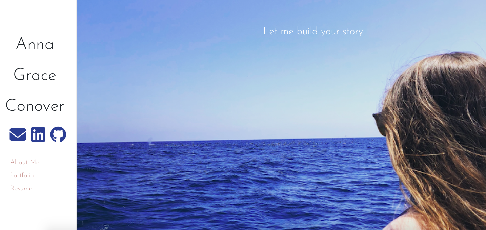

# Anna Grace Conover Portfolio

## Description
This website is my portfolio, where you can find examples of my work and links to the live websites I've created. My bio and resume is included as well.
## Table of Contents
* [Installation](#installation)
* [Usage](#usage)
* [License](#license)
* [Contributing](#contributing)
* [Links](#Links)
* [Tenchnologies](#Technologies)
* [Icebox](#Icebox)
* [Developer](#Developers)

## Installation
npm i in portfolio-react
## Usage
This is a react app. You run it locally in portfolio-react in the terminal or bash with npm start.

It is live with GitHub Pages

## License
MIT

## Contributing
No contributors allowed - portfolio work.

## Links
* GitHub repository URL: https://github.com/annaxgrace/Portfolio
* GitHub Pages Deployed URL: annaxgrace.github.io/Portfolio

## Technologies

### Languages 
* HTML, CSS, React.js, 

### FrameWorks
* Bootstrap

## Icebox

* Mobile Capabilities
* Carousel through page images

## Developer

### Anna Conover

* Github username: annaxgrace
* Email: anna.grace.conover@gmail.com
* Deployed Project URL: annaxgrace.github.io/Portfolio

